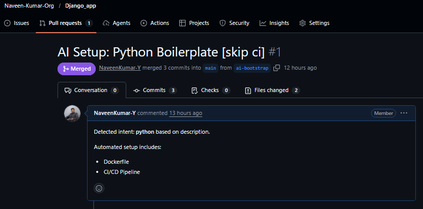
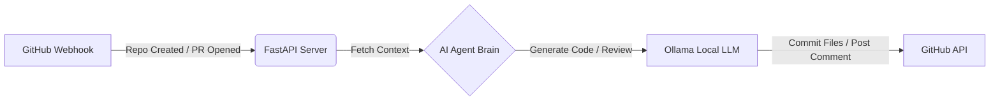

# AI DevOps Agent

This is a personal project where I built an AI agent to help me with DevOps tasks. It runs on a server (I used an Azure VM) and listens to my GitHub account(Organization).

Basically, whenever I create a new repository or open a Pull Request, this agent wakes up and does the work for me.

This automation standardizes repository setup and acts as an always-on security guard, reducing the time to onboard new services from hours to minutes.

## What it does

**Auto-Setup for new Repos:**
* If I create a new repo and write a description like "A simple python app", the AI reads it.
* It automatically creates a `Dockerfile` and a GitHub Actions workflow (`ci.yml`) for that language.
* It opens a Pull Request with these files so I can just merge them.

eg:</br>



**Code Review:**
* When I open a Pull Request, the AI reads my code changes.
* It posts a comment on the PR if it finds bugs or security issues.

eg:</br>


It uses **Ollama** to run the AI models locally on my server. No OpenAI API keys required.


## My Tech Stack

* **Python (FastAPI)** for the web server.
* **Ollama** to run the LLM (I used the `gemma2:2b` model because it's fast).
* **Azure VM** (Ubuntu) to host it.
* **GitHub Webhooks** to talk to the agent.

---

## Architecture



---

## How to Run This

I ran this on an Ubuntu VM in Azure. You can use any Linux machine or even your local computer if you expose the port.

### 1. Initial Setup Script

Run this script to install Docker, Python, and Ollama. It also pulls the AI model.

```bash
git clone https://github.com/NaveenKumar-Y/ai-devops-demo-app
cd ai-devops-demo-app
./configure_agent.sh
```

### 2. Add your GitHub Token

You need a Personal Access Token (PAT) so the code can push files to your repos.

export GITHUB TOKEN in the environment variables:
```
export GITHUB_TOKEN=ghp_your_token_here...

```


*(Make sure your token has `repo` and `workflow` permissions!)*

**Note**: This demo uses a Personal Access Token (PAT) for simplicity. For a production environment, I would implement OpenID Connect (OIDC) or Workload Identity Federation to eliminate static secrets and enable secure, keyless authentication.

### 3. Start the Server

Run this command to start the app:

```bash
uvicorn main:app --host 0.0.0.0 --port 8000

```

---

## Connecting to GitHub

For the agent to actually "see" your repos, you need to add a Webhook.

1. Go to your **GitHub Settings** (or specific Repo Settings) -> **Webhooks**.
2. Click **Add webhook**.
3. **Payload URL:** `http://YOUR_VM_ENDPOINT:8000/webhook`
* *Note: If you restart your VM, this IP might change unless you set a static one.*


4. **Content type:** Select `application/json` (**Important!** Default is urlencoded which won't work).
5. **Which events?** Select "Let me select individual events" and check:
* [x] **Pull requests**
* [x] **Repositories**


6. Click **Add webhook**.

That's it. Now just create a new empty repo in our orginization with a description to test it out!


***Testing Examples:***</br>
- AI agent created the bolierplate files based on repo description: https://github.com/Naveen-Kumar-Org/Django_app/pull/1
- AI agent reviewed the code changes: https://github.com/Naveen-Kumar-Org/Django_app/pull/5#issuecomment-3906304691
